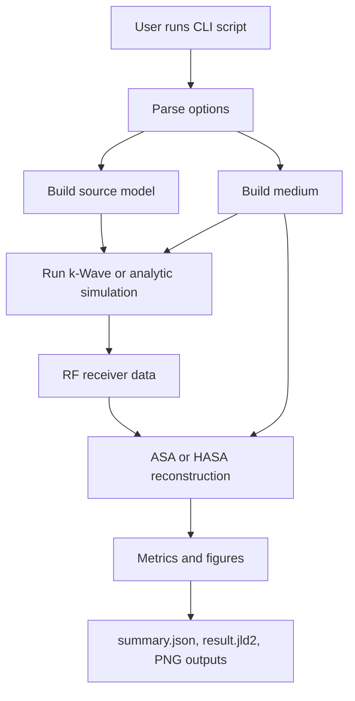

# High-Level Workflow

The repository is designed around script-level workflows. A typical PAM run goes through the same stages regardless of whether it is 2D or 3D.

## Source Setup

The runner first turns CLI coordinates into source objects:

- `point` sources are explicit tone-burst emitters.
- `squiggle` sources expand each anchor into a sampled vascular-like centerline.
- `network` sources grow a random branching 3D centerline structure and sample emitters inside an ellipsoid.

Point sources are best for localization tests. Squiggle and network sources are intended for activity mapping and thresholded detection analysis.

## Medium Setup

For `--aberrator=none`, the medium is homogeneous water. For `--aberrator=skull`, the runner loads CT data, creates a skull/lens medium, and places it below the receiver plane according to `--skull-transducer-distance-mm`.

Source coordinates remain defined relative to the receiver/transducer plane, not relative to the skull surface.

## Forward Simulation

The forward model produces RF pressure traces at the receiver plane. The maintained backend is k-Wave through the Julia/Python bridge. Some homogeneous cases can use the analytic backend.

`--kwave-use-gpu` controls the k-Wave backend. This is separate from reconstruction GPU usage.

## Reconstruction

PAM reconstruction back-propagates the recorded RF data into the image domain:

- Geometric ASA uses a homogeneous propagation model.
- HASA includes a heterogeneous correction term derived from the sound-speed field.
- Full reconstruction processes the full RF record at once.
- Windowed reconstruction partitions RF data into overlapping time windows and accumulates incoherent intensity.

`--recon-mode=auto` uses full reconstruction for point sources and windowed reconstruction for squiggle/network activity.

## Analysis

Point-source runs report localization-style metrics such as peak location and error. Activity runs report thresholded detection metrics such as precision, recall, F1, false-positive area, and false-negative area.

The complete run configuration and summary metrics are written to `summary.json`; numerical arrays and intermediate data are written to `result.jld2`.
